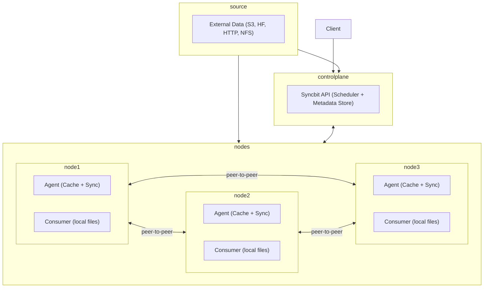

# Syncbit

Syncbit is a high-performance, peer-assisted data distribution engine for large datasets such as machine learning model weights, container layers, and structured data files. It is designed for use in clustered environments — bare-metal or cloud-native — with coordination and automation at the core.

Syncbit enables reproducible and efficient distribution of large files to specific nodes in a cluster, integrating with container orchestration systems such as Kubernetes to provide reliable, local-access guarantees for downstream workloads.

## Features

- 🚀 High-throughput file distribution across cluster nodes via peer-to-peer block transfer
- 🎯 Centralized coordination and scheduling to target specific nodes with specific datasets
- 💾 Disk-backed block-level caching with read-through/write-through LFRU (Least-Frequently/Recently Used) eviction policy
- 🔗 Deduplicated block storage across datasets and versions to reduce bandwidth
- 🪪 Pluggable source support: HTTP(S), S3, HuggingFace, local NFS/shared storage, and others
- 🧠 Node-local coordination daemon for transfer, cache tracking, and health reporting
- 📦 Kubernetes-friendly design for integration with:
    - Node labeling & taints
    - Dataset readiness gates for container startup
    - Sidecar or initContainer integration
    - hostPath coordination for local storage

## Intended Use Cases

- Preloading large ML models (e.g., LLaMA, Mixtral, DeepSeek) onto GPU nodes for optimal loading into memory
- Distributing versioned datasets (e.g., Parquet, CSV, TFRecord) for training/inference
- Distributing OCI container images or layers for airgapped deployments
- Managing rollout of application update payloads (e.g., firmware, binaries)
- Managing lifecycle of datasets and sharding across nodes
- Distributing any large files to specific nodes for local access

## Architecture Overview

Syncbit consists of:
- **Syncbit Daemon (syncbit):** runs on each participating node and manages block cache, transfer, and sync state
- **Central Scheduler:** assigns dataset sync tasks to eligible nodes, with awareness of node attributes and dataset metadata
- **Source Connectors:** download handlers for external and internal sources (HTTP, S3, HuggingFace, NFS, etc.)
- **Peer Communication Layer:** essential mechanism for sharing blocks directly between nodes
- **Metadata Store:** stores dataset metadata and block availability
- **Block Cache:** disk-backed block-level caching with read-through/write-through for optimal read-after-write performance, deduplication, and local access



## Quickstart

```bash
# Start the local daemon (runs on each node)
syncbit daemon --config /etc/syncbit/config.yaml

# Request a dataset
syncbit pull s3://your-bucket/model-weights/llama-3-70b

# Check status
syncbit status
```

## License

This project is licensed under the Apache 2.0 License.

## Acknowledgements

Inspired by P2P file synchronization systems like Syncthing and BitTorrent, but designed with cloud-native cluster operations in mind.
