# Syncbit

Syncbit is a high-performance, peer-assisted data distribution engine for large datasets such as machine learning model weights, container layers, and structured data files. It is designed for use in clustered environments — bare-metal or cloud-native — with coordination and automation at the core.

Syncbit enables reproducible and efficient distribution of large files to specific nodes in a cluster, integrating with container orchestration systems such as Kubernetes to provide reliable, local-access guarantees for downstream workloads.

## 🚀 Project Status

Syncbit is actively under development with core functionality implemented:
- ✅ **Controller + Agent Architecture**: Fully functional central scheduler and distributed agents
- ✅ **Multi-Provider Support**: HuggingFace, HTTP, S3, and peer-to-peer transfers
- ✅ **Job Scheduling**: Download job submission, status tracking, and distribution strategies
- ✅ **P2P File Sharing**: Agent-to-agent transfers with file availability tracking
- ✅ **Disk-Backed Caching**: RAM + disk cache with deduplication and LRU eviction
- ✅ **Comprehensive Testing**: E2E tests with P2P replication factor validation
- 🔄 **In Progress**: Cache metadata persistence, reconciliation loops, disk usage limits

## Features

- 🚀 **High-throughput file distribution** across cluster nodes via peer-to-peer transfer
- 🎯 **Centralized coordination and scheduling** to target specific nodes with specific datasets
- 💾 **Disk-backed caching** with read-through/write-through LRU eviction policy
- 🔗 **Deduplicated file storage** across datasets and versions to reduce bandwidth
- 🪪 **Pluggable source support**: HTTP(S), S3, HuggingFace, and peer-to-peer transfers
- 🧠 **Node-local coordination daemon** for transfer, cache tracking, and health reporting
- 📊 **Comprehensive monitoring** with detailed statistics and job tracking
- 🔄 **Replication factor support** for high availability and load distribution
- 📦 **Kubernetes-ready** design for integration with container orchestration

## Architecture Overview

Syncbit consists of two main components:

### **syncbitd** - The Daemon
- **Controller Mode**: Central scheduler that assigns download tasks and tracks file availability
- **Agent Mode**: Runs on each node, manages local cache, executes downloads, and handles P2P transfers

### **syncbit** - The CLI Client
- Submit download jobs to the controller
- Monitor job status and progress
- List active jobs across the cluster

```mermaid
%%{ init: { 'flowchart': { 'curve': 'catmulRom' } } }%%
graph TB
    subgraph "External Sources"
        HF["🤗 HuggingFace"]
        S3["☁️ S3"]
        HTTP["🌐 HTTP(S)"]
    end

    subgraph "Control Plane"
        Controller["📋 Controller<br/>(Job Scheduler)"]
    end

    subgraph "Cluster Nodes"
        subgraph "Node 1"
            Agent1["🤖 Agent"]
            Cache1["💾 Cache"]
            Consumer1["📱 Consumer"]
        end

        subgraph "Node 2"
            Agent2["🤖 Agent"]
            Cache2["💾 Cache"]
            Consumer2["📱 Consumer"]
        end

        subgraph "Node 3"
            Agent3["🤖 Agent"]
            Cache3["💾 Cache"]
            Consumer3["📱 Consumer"]
        end
    end

    CLI["💻 syncbit CLI"]

    CLI --> Controller
    Controller <--> Agent1
    Controller <--> Agent2
    Controller <--> Agent3

    Agent1 <-->|P2P Transfer| Agent2
    Agent2 <-->|P2P Transfer| Agent3
    Agent1 <-->|P2P Transfer| Agent3

    Agent1 --> Cache1
    Agent2 --> Cache2
    Agent3 --> Cache3

    Cache1 --> Consumer1
    Cache2 --> Consumer2
    Cache3 --> Consumer3

    HF --> Agent1
    S3 --> Agent2
    HTTP --> Agent3
```



## Quick Start

### 1. Build the Binaries

```bash
# Build both the daemon and CLI
go build -o bin/syncbitd ./cmd/syncbitd
go build -o bin/syncbit ./cmd/syncbit
```

### 2. Start the Controller

```bash
# Start the central coordinator
./bin/syncbitd controller --config config.controller.yaml
```

### 3. Start Agents on Each Node

```bash
# On each participating node
./bin/syncbitd agent --config config.agent.yaml
```

### 4. Submit Download Jobs

```bash
# Download specific files from HuggingFace with distribution to 2 agents
./bin/syncbit submit microsoft/DialoGPT-medium \
  --files config.json tokenizer.json \
  --local-path /models/DialoGPT-medium \
  --distribution count \
  --target-count 2
```

### 5. Monitor Progress

```bash
# List all jobs
./bin/syncbit list

# Check specific job status
./bin/syncbit status download-microsoft-DialoGPT-medium-config.json-1234567890-0
```

## Configuration

Syncbit uses YAML configuration files with support for named providers. See [`config.example.yaml`](config.example.yaml) for the complete reference.

### Controller Configuration

```yaml
# config.controller.yaml
controller:
  network:
    listen_addr: "http://0.0.0.0:8080"
    advertise_addr: "http://controller:8080"
  scheduler:
    heartbeat_timeout: "60s"
    schedule_interval: "5s"
```

### Agent Configuration

```yaml
# config.agent.yaml
daemon:
  controller_addr: "http://controller:8080"
  providers:
    hf-public:
      id: "hf-public"
      type: "hf"
      name: "HuggingFace Public"
    peer-main:
      id: "peer-main"
      type: "peer"
      name: "Peer-to-Peer Transfer"

agent:
  id: "agent-1"
  storage:
    base_path: "/var/lib/syncbit"
    cache:
      ram_limit: "4GB"
      disk_limit: "0"
  network:
    listen_addr: "http://0.0.0.0:8081"
    advertise_addr: "http://agent-1:8081"
    heartbeat_interval: "30s"
```

## CLI Reference

### Job Management

```bash
# Submit HuggingFace download job
syncbit submit microsoft/DialoGPT-medium \
  --files config.json tokenizer.json pytorch_model.bin \
  --local-path /models/DialoGPT-medium \
  --provider hf-public \
  --revision main

# Distribution strategies
syncbit submit repo/model \
  --files model.bin \
  --local-path /models \
  --distribution single          # Download to one agent only
  --distribution all             # Download to all agents
  --distribution count           # Download to specific number of agents
  --target-count 3
  --distribution specific        # Download to specific agents
  --target-agents agent-1,agent-3

# List all jobs
syncbit list

# Check job status
syncbit status <job-id>
```

### Monitoring

```bash
# Check controller stats
curl http://localhost:8080/stats

# Check agent status
curl http://localhost:8081/state

# View cache statistics
curl http://localhost:8081/cache/stats
```

## Supported Providers

### HuggingFace (`hf`)
```yaml
providers:
  hf-public:
    id: "hf-public"
    type: "hf"
    name: "HuggingFace Public"
  hf-private:
    id: "hf-private"
    type: "hf"
    token: "${HF_TOKEN}"
```

### AWS S3 (`s3`)
```yaml
providers:
  s3-default:
    id: "s3-default"
    type: "s3"
    region: "us-west-2"
    profile: "default"
```

### HTTP/HTTPS (`http`)
```yaml
providers:
  http-api:
    id: "http-api"
    type: "http"
    token: "${API_TOKEN}"
    headers:
      "User-Agent": "SyncBit/1.0"
```

### Peer-to-Peer (`peer`)
```yaml
providers:
  peer-main:
    id: "peer-main"
    type: "peer"
    name: "Peer Transfer"
```

## Testing & Development

### Run Comprehensive P2P Tests

```bash
# Quick P2P test with monitoring
./run_p2p_test.sh

# Full end-to-end test
./test_e2e.sh

# Monitor logs in real-time
./monitor_logs.sh all
```

### Test Scripts

- **`run_p2p_test.sh`**: Quick P2P replication test with replication factor 2
- **`test_e2e.sh`**: Comprehensive end-to-end test with multiple agents
- **`monitor_logs.sh`**: Real-time log monitoring for all services
- **`client_test.sh`**: API client testing script

### Integration Tests

```bash
# Run integration tests
go test ./internal/integration/...

# Run specific P2P tests
go test -v ./internal/integration -run TestPeerToPeerFileSharing
```

## API Endpoints

### Controller API

| Endpoint | Method | Description |
|----------|---------|-------------|
| `/health` | GET | Health check |
| `/stats` | GET | Controller statistics |
| `/jobs` | GET | List all jobs |
| `/jobs` | POST | Submit new job |
| `/jobs/{id}` | GET | Get job details |
| `/jobs/stats` | GET | Job scheduler statistics |
| `/agents` | GET | List registered agents |

### Agent API

| Endpoint | Method | Description |
|----------|---------|-------------|
| `/health` | GET | Health check |
| `/state` | GET | Agent state and active jobs |
| `/cache/stats` | GET | Cache statistics |
| `/datasets` | GET | List cached datasets |
| `/datasets/{name}/files/{path}` | GET | Download file from cache |
| `/datasets/{name}/files/{path}/info` | GET | Get file metadata |

## Use Cases

### ML Model Distribution
```bash
# Distribute LLaMA model to GPU nodes
syncbit submit meta-llama/Llama-2-7b-hf \
  --files pytorch_model.bin config.json tokenizer.json \
  --local-path /models/llama-2-7b \
  --distribution specific \
  --target-agents gpu-node-1,gpu-node-2
```

### Dataset Synchronization
```bash
# Sync training dataset across all nodes
syncbit submit huggingface/dataset \
  --files train.parquet validation.parquet \
  --local-path /data/training \
  --distribution all
```

### High Availability Setup
```bash
# Ensure model availability on multiple nodes
syncbit submit microsoft/DialoGPT-medium \
  --files pytorch_model.bin \
  --local-path /models/dialog \
  --distribution count \
  --target-count 3
```

## Monitoring & Observability

Syncbit provides comprehensive monitoring through:
- **Job Status Tracking**: Real-time job progress and completion status
- **Cache Statistics**: Hit rates, disk usage, and memory consumption
- **Agent Health**: Heartbeat monitoring and availability tracking
- **Transfer Metrics**: Download speeds, P2P efficiency, and error rates

## Roadmap

See [TODO.md](TODO.md) for the current development roadmap, including:
- Cache metadata persistence across restarts
- Automatic reconciliation loops for desired state
- Disk usage limits and intelligent eviction
- Enhanced replication and distribution strategies
- Kubernetes operator and CRDs

## License

This project is licensed under the Apache 2.0 License. See [LICENSE](LICENSE) for details.

## Acknowledgements

Inspired by P2P file synchronization systems like Syncthing and BitTorrent, but designed with cloud-native cluster operations and ML workload requirements in mind.
